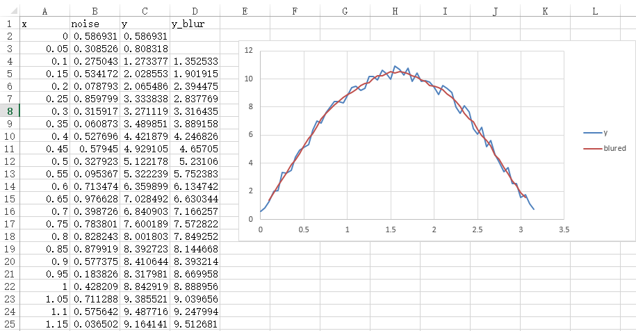
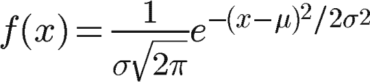
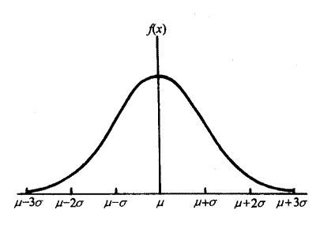
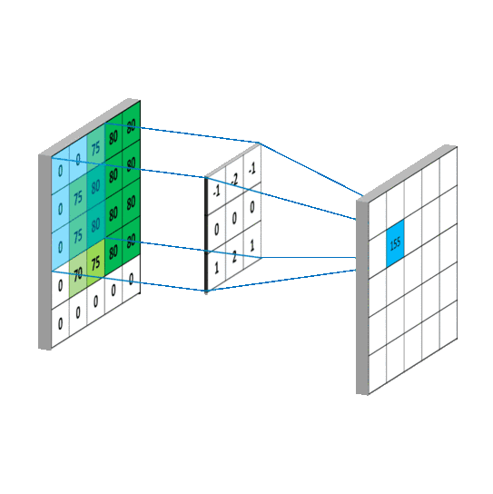
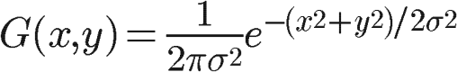
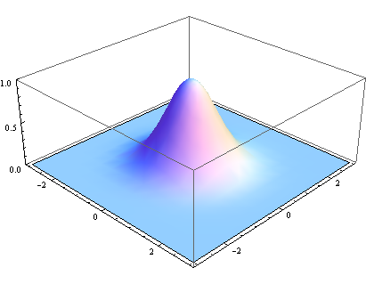
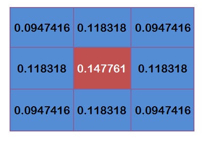

  
# 高斯模糊详解  
## 简介  
&emsp;&emsp;早在高中，图像模糊就勾起我的兴趣：为什么近视眼看东西会模糊、透过毛玻璃的像为什么会模糊、以及win7的毛玻璃模糊特效是如何实现的，当时也有方式去查资料去实现这样的一个效果。转眼本科毕业，最近又出现一个比较热门的话题：国内安卓魔改系统的的实时模糊在高帧率下的表现，实时模糊这东西在移动操作系统上还是IOS先做起的，并且在性能方面还很好。其实看完这篇文章就会发现，高斯模糊的时间复杂度是非常高的，一味追求实时高斯模糊，是否有必要？  

## 从最简单的均值模糊开始讲起
&emsp;&emsp;如果将一组凹凸不平的数据，将某个点前后5个点的平均值建立一个新的函数，即g[x]=(f[x-2]+f[x-1]+f[x]+f[x+1]+f[x+2])/5，那么这个函数就会变得平滑起来，可以用excel来进行简单仿真。
  
&emsp;&emsp;蓝线是一个加了随机噪声的sin函数，红线将其进行平滑后的曲线。红线明显更加平滑，更加像原本的sin函数。为什么能产生这样的效果？  
&emsp;&emsp;上面的操作，我们是在进行卷积。卷积核在时域上是一个窗函数，在频域，是一个升余弦X1(jw)。
  
&emsp;&emsp;在频域上，升余弦对于高频信号有一定抑制能力。时域的卷积就是频域的乘积。在时域上面对数据进行平均值处理，具有抑制高频的能力，即数据看上去更加平滑了，这就是滤波。那么对于二维的情况，就是对某个像素点在一定半径内的像素点求平均，得到这个像素点。这是二维的卷积。  
&emsp;&emsp;但是升余弦的频率特性在w>π时仍存在一定的幅度，即无法很好地抑制高频。在这里可能看不出来，在图像处理中，可以明显看到这种模糊算法得到的图像不够平滑。  
  
  
&emsp;&emsp;可以看出均值模糊的效果非常不自然，那么就要引入一种更加平滑的频率曲线来抑制高频，这就是高斯模糊  

## 高斯函数  
&emsp;&emsp;高中数学书就讲过一种自然界广泛存在的概率分布函数——正态分布，它的别名就是高斯分布。  
  
  
&emsp;&emsp;为什么选用高斯函数？个人的理解是：对于大部分的镜头，在未对焦的平面上若存在一个点光源，成像得到的就是这个点光源半径变大，变成一个中心最亮，向两周逐渐变暗的光斑。假如背景全是黑的，我们就得到了这个镜头的冲击响应。分析光斑从中心到边缘的亮度分布，就会发现这个分布还是会比较像高斯分布的，不能说完全一致，但是用高斯分布以假乱真，没有大问题。  
&emsp;&emsp;高斯函数神奇的处在于，它在时域和频域都是高斯函数。在频域上，根据3σ准则，频域上位于3σ之外的高频信号几乎被去除。不像均值模糊那样还保留部分微弱高频信号。所以整体会比较平滑。  
  

## 算法实现  
&emsp;&emsp;先从高斯模糊的算法开始讲起。离散的二维卷积和一维卷积都一样，都是某个像素点附近的数值乘以对应的权重，最后将结果赋值到这个像素点。一个GIF生动形象地表示这一过程：  
  
&emsp;&emsp;左边那个就是原图像，右边那个是卷积结果，中间就是卷积核。首先需要先计算一个高斯卷积核，计算公式就是将x,y 2个维度的高斯函数相乘。  
  
  
&emsp;&emsp;将二维高斯函数采样得到离散的卷积核，同时，还有乘以一个数使得卷积核内所有的值的和等于1。  
  
&emsp;&emsp;得到卷积核之后，就可以进行计算了，首先先对图像的每一个像素点进行遍历，这是一个二重循环。然后在这个循环内再对这个像素点附近的像素点进行计算，这又是一个二重循环。所以完成整张图像的高斯模糊，需要进行四重循环，并且这还是浮点运算，这是一种效率非常非常低的算法，但是这就是高斯模糊在串行计算中的实现方法。实际一跑就发现，这种算法的速度根本无法接受，但是为什么在Win7、Win10和IOS等系统却能实现流畅的模糊效果呢？串行计算的确慢，但是在高斯模糊的过程中，很多东西都是可以并行计算的，一张图像可以分割成很多份，在同一时间同时处理，这样就大大缩减了计算时间，这就是GPU的能力范畴。但是这种算法的效率低是不可否认的，实际上也存在替代的算法。  
## 均值模糊  
&emsp;&emsp;有没有一种似乎又回到了原点的感觉？前面讲到升余弦的高频信号抑制能力弱。但是，如果将这个升余弦，做个平方、立方、四次方计算呢？会发现这个频率特性曲线对于高频的抑制能力变强了不少    
  
&emsp;&emsp;频域的乘积就是时域的卷积，升余弦的三次方，可以通过时域进行3次相同的卷积来实现，即同一个模糊算法执行3次。整体来看，这个频率特性曲线看上去就很像高斯函数了。实际上进行多次均值模糊得到的结果肉眼也看不出其与高斯模糊区别，用多次均值模糊代替高斯模糊，完全可行。  
&emsp;&emsp;凭什么均值模糊可以有更高的效率呢？均值模糊没有复杂的卷积核，可以使用整形运算完成图像处理，即使是在串行计算时相同的四重循环下，其效率也会比高斯模糊高不少。再者，均值模糊因为卷积核内的权重相同，有一些优化的方法。其中一种优化思路为：在行循环求平均值时，可以减一个像素再加一个像素得到和，而不是做一次循环。因此可以将四重循环降低成三重循环，在大半径的模糊下，这可以显著提高效率。  
## 仓库代码的使用方法  
&emsp;&emsp;分别解除注释对应代码块，即可运行3种模糊算法。
```
//均值模糊
/*
bmp.AverageBlur2(50);
bmp.Save("1080POutputA.bmp");
*/

//3次均值模糊模拟高斯模糊
/*
bmp.AverageBlur2(50);
bmp.AverageBlur2(50);
bmp.AverageBlur2(50);
bmp.Save("1080POutputA2.bmp");
*/

//高斯模糊
/*
float*weights=createGaussianKernel(50);
bmp.GaussianBlur(weights,50);
bmp.Save("1080POutputG.bmp");
*/
```  
&emsp;&emsp;因为有些函数无法忍受效率问题，所以全程使用指针，这导致代码的可阅读性非常差，只供参考。  
## 总结
&emsp;&emsp;加入跑过一次代码，就会发现高斯模糊在串行技术里面的效率是非常非常低的，当然在并行运算下，效率使可以接受的。比较令人接受的是通过多次均值模糊模拟的高斯模糊，在不影响效果的情况下，还可以有比较好的效率。但又没有必要为了美观而去追求高帧率的实时“高斯模糊”呢？其实没什么必要。

参考：  
http://www.ruanyifeng.com/blog/2012/11/gaussian_blur.html  
https://yemi.me/2018/04/30/super-fast-blur-gpu/